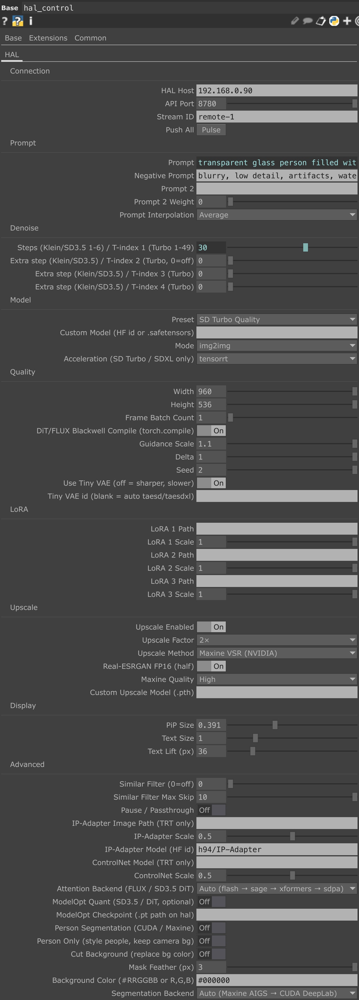

# High-Speed StreamDiffusion ↔ TouchDesigner (NDI)

Run real-time StreamDiffusion with video input + prompts on a networked Linux
machine while controlling it remotely from TouchDesigner (Mac/Windows) live.

960x540 cam diffusion receives **27 FPS @ 1920x1080** w/SD Turbo Quality model +
2x video upscaling via maxine-vsr on NVIDIA RTX Pro 6000 Blackwell, video input
and Touch running on MacBook Pro M1 running on smae network.

https://github.com/user-attachments/assets/6873a297-e2fb-4bc6-a787-74b4f754001c

Video is sent and received over NDI, and controls are sent over WebSocket or
the Daydream-style REST API.

Features:

- **Prompting** — main + negative + blended second prompt
- **Models** - SD Turbo / SDXL Turbo / LCM-LoRA / FLUX Klein / SD3.5 / custom
- **V2V** — temporal img2img (turbo) or DiT-based person segmentation (all pipelines)
- **LoRA** — up to 3 simultaneous LoRAs (SD Turbo / SDXL Turbo only)
- **ControlNet** — optional ControlNet conditioning (SD Turbo / SDXL Turbo only)
- **Upscaling** — GPU upscaling NVIDIA Maxine VSR, Real-ESRGAN and Bicubic
- **IP-Adapter** — optional IP-Adapter conditioning (SD Turbo / SDXL Turbo only)
- **Person Segmentation** — GPU-accelerated CUDA DeepLab on Blackwell for person masks, with feathering and background cutout options
- **Attention backend** — multiple options including TensorRT and xformers for turbo, flash/sage/xformers/sdpa for FLUX.2 Klein and SD3.5 DiT
- **Acceleration** — TensorRT / xformers for SD Turbo / SDXL Turbo; attention backend for FLUX.2 Klein and SD3.5 DiT
- **Denoising** — multiple steps for flexible strength control (turbo) or DiT-based quality control (all pipelines)



## TouchDesigner setup

You can use `toe/sdremote1.toe` out the gate.
- Adjust vidin for video input.
- Control all features from `hal_control`, or use "View" on `hal_control_ui`

### Alternatively adding to existing TouchDesigner setup

**Build control UI** (once, or after repo updates):

```python
exec(open("/Users/samy/c/touch/samysd/touchdesigner/build_hal_control.py", encoding="utf-8").read())
```

**Upgrade existing UI** (add new params without destroying the COMP):

```python
exec(open("/Users/samy/c/touch/samysd/touchdesigner/upgrade_hal_control.py", encoding="utf-8").read())
```

**On hal** — start the bridge (once per session):

```bash
./scripts/run_bridge_screen.sh "optional initial prompt"
```

Changes in `hal_control` sync automatically (~350ms debounce). Use **Push All** to force a full sync.

| TD node | Path (instance A) |
|---|---|
| Control COMP | `/project1/hal_control` |
| Control panel | `/project1/hal_control_ui` |
| NDI send | `td_streamdiffusion_in` |
| NDI receive | `streamdiffusion_out` |
| API | `http://<hal-ip>:8780/v1/streams/remote-1` |

Dual instances: see `touchdesigner/DUAL_INSTANCES.md`.

---

## Features (all controlled from TouchDesigner)

Everything below lives on **`hal_control`** unless noted.

### Connection
| TD parameter | What it does |
|---|---|
| Remotehost, Remoteport, Streamid | Which hal + stream to PATCH |
| Push All | Force full param sync |

### Prompt
| TD parameter | What it does |
|---|---|
| Prompt | Main text prompt |
| Negativeprompt | Negative prompt |
| Prompt2, Prompt2weight | Second prompt + blend weight |
| Promptinterp | Multi-prompt blend mode |

### Denoise / strength
| TD parameter | What it does |
|---|---|
| Denoise | Primary denoise step (turbo: t_index 15–49; Klein/SD3.5: step count 1–6) |
| Step2, Step3, Step4 | Extra denoise steps (`0` = off). Turbo: additional t_index values. **v2v needs Step2 > 0.** |

### Model & mode
| TD parameter | What it does |
|---|---|
| Preset | Model + pipeline preset (see table below) |
| Modelid | Custom HF id or `.safetensors` path (optional) |
| Sdmode | `img2img`, `txt2img`, `v2v`, `passthrough` |
| Acceleration | `tensorrt` / `xformers` / `none` — **SD Turbo / SDXL only** |
| Attentionbackend | `auto` / flash / sage / xformers / sdpa / none — **FLUX & SD3.5 DiT** |

### Quality
| TD parameter | What it does |
|---|---|
| Width, Height | Inference resolution (NDI in is resized; snapped to ÷8 turbo / ÷16 DiT) |
| Framebatch | Temporal batch depth — **keep at 1 for turbo v2v**; used by FLUX quality / DiT |
| Fluxtransformerengine | Blackwell `torch.compile` for FLUX / SD3.5 |
| Modeloptenabled, Modeloptcheckpoint | Optional ModelOpt quant (SD3.5) |
| Guidance, Delta, Seed | CFG / RCFG / seed |
| Usetinyvae, Vaeid | Tiny VAE on/off (v2v auto uses full VAE on hal) |

### LoRA (SD presets)
| TD parameter | What it does |
|---|---|
| Lora1–3 path + scale | Up to 3 LoRAs |

### Upscale (post-inference, GPU)
| TD parameter | What it does |
|---|---|
| Upscaleenabled | On/off |
| Upscalefactor | 1× / 2× / 4× |
| Upscalemethod | `maxine-vsr` (NVIDIA), `realesrgan`, `bicubic` |
| Upscalemaxinequality | Maxine quality preset |
| Upscalehalf | Real-ESRGAN FP16 |
| Upscalemodel | Custom `.pth` path |

### V2V / person segmentation
| TD parameter | What it does |
|---|---|
| Sdmode = v2v | Temporal img2img (needs **Step2 > 0**, Framebatch = 1 on turbo) |
| Segmentenabled | GPU person mask (CUDA DeepLab on Blackwell) |
| Persononly | Style people only; keep camera background |
| Cutbackground | Replace background with solid color |
| Segmentfeather | Mask edge soften |
| Backgroundcolor | Cutout color `#RRGGBB` or `R,G,B` |
| Segmentbackend | `auto` / `maxine` / `cuda` |

### Advanced
| TD parameter | What it does |
|---|---|
| Filterthreshold, Filterskip | Skip near-identical frames (0 = off) |
| Pausestream | Passthrough raw NDI (no model) |
| Ipimagepath, Ipscale, Ipmodel | IP-Adapter *(UI wired; needs TRT implementation)* |
| Controlnetmodel, Controlnetscale | ControlNet *(UI wired; needs TRT implementation)* |

### Display *(TouchDesigner HUD only — does not sync to hal)*
| TD parameter | What it does |
|---|---|
| Pipscale, Textscale, Textlift | PiP + overlay text layout on `vidout/combine` |

---

## Supported models

| Preset | Model | Pipeline | Default accel |
|---|---|---|---|
| `sd_turbo_fast` | [stabilityai/sd-turbo](https://huggingface.co/stabilityai/sd-turbo) | StreamDiffusion | TensorRT |
| `sd_turbo_quality` | stabilityai/sd-turbo | StreamDiffusion (2-step) | TensorRT |
| `sdxl_turbo_fast` | [stabilityai/sdxl-turbo](https://huggingface.co/stabilityai/sdxl-turbo) | StreamDiffusion | TensorRT |
| `sdxl_turbo_quality` | stabilityai/sdxl-turbo | StreamDiffusion (2-step) | TensorRT |
| `lcm_lora_style` | [runwayml/stable-diffusion-v1-5](https://huggingface.co/runwayml/stable-diffusion-v1-5) + LCM LoRA | StreamDiffusion | TensorRT |
| `flux2_klein_fast` | [FLUX.2-klein-4B](https://huggingface.co/black-forest-labs/FLUX.2-klein-4B) | FLUX Klein | none + attention backend |
| `flux2_klein_quality` | FLUX.2-klein-4B | FLUX Klein | none + attention backend |
| `flux2_klein_9b` | [FLUX.2-klein-9B](https://huggingface.co/black-forest-labs/FLUX.2-klein-9B) | FLUX Klein | none + attention backend |
| `sd35_medium_fast` | [stable-diffusion-3.5-medium](https://huggingface.co/stabilityai/stable-diffusion-3.5-medium) | DiT | none + attention backend |
| `sd35_medium_quality` | stable-diffusion-3.5-medium | DiT | none + attention backend |
| `sd35_large_fast` | [stable-diffusion-3.5-large](https://huggingface.co/stabilityai/stable-diffusion-3.5-large) | DiT | none + attention backend |
| `passthrough` | — | NDI loopback | — |

Custom checkpoint: set **Modelid** to a HuggingFace id or local `.safetensors` path.

**HF licenses required:** FLUX.2 Klein, SD3.5 Medium/Large.

---

## Hal setup (once)

Blackwell / CUDA 13.2:

```bash
./scripts/setup_blackwell_linux.sh
./scripts/install_streamdiffusion_deps.sh
./scripts/install_tensorrt_deps.sh
./scripts/install_upscaler_deps.sh          # Maxine VSR
./scripts/install_attention_deps.sh         # xformers / flash
./scripts/install_flux2_klein_deps.sh       # optional
./scripts/install_dit_deps.sh               # SD3.5 optional
./scripts/install_segmentation_deps.sh      # person mask optional
```

Deploy code changes from Mac:

```bash
./scripts/sync_to_hal.sh
```

---

## CLI / env (optional — launch only)

Bridge defaults match TD instance A (`sd_turbo_fast`, 960×536, TensorRT, 2× Maxine).

```bash
./scripts/run_bridge_screen.sh "prompt"
SDTD_PRESET=sd_turbo_quality SDTD_ACCELERATION=tensorrt ./scripts/run_bridge_screen.sh
```

Status:

```bash
curl -s http://hal:8780/v1/streams/remote-1 | jq '{status: .runtime.status, mode: .runtime.mode, fps: .runtime.fps_out, t: .runtime.t_index_list}'
```

WebSocket control (`:8765`) still works; **TouchDesigner uses REST** via `hal_remote_sync`.

---

## Troubleshooting

| Problem | Fix |
|---|---|
| TD changes ignored | Run `upgrade_hal_control.py`; pulse **Push All** |
| v2v looks same as img2img | Set **Step2 > 0** (Step2=0 = identical to img2img) |
| v2v flicker | Keep Step2 within ~8 of Denoise; avoid tiny VAE (auto-off in v2v) |
| TensorRT batch error | Framebatch = 1 on turbo; reload preset after mode change |
| FLUX / SD3.5 missing | Run install scripts + accept HF license |
| Slow upscale | Use `maxine-vsr`; or infer smaller |

More detail: `touchdesigner/README.md`, `touchdesigner/SDTD_REMOTE.md`.
